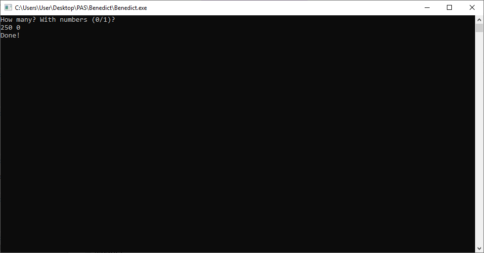

# Benedict
Benedict Timothy Carlton Cumberbatch - Name Generator

You can compile PAS-file by yourself or use [mine release](https://github.com/Meridiano/Benedict/releases) (64-bit). Launch it and enter count of names and 0/1 for numbers. Example:

That's all. Sorry, mr.Cumberbatch.
